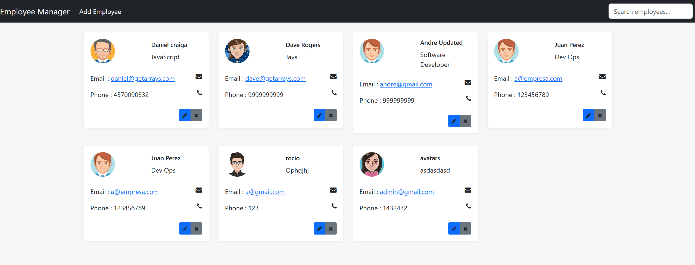
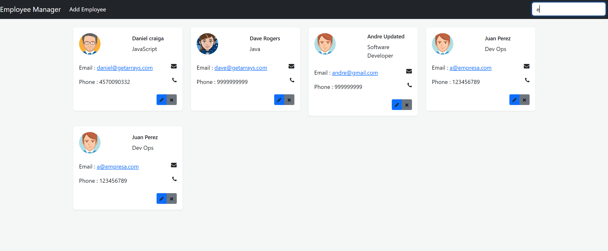
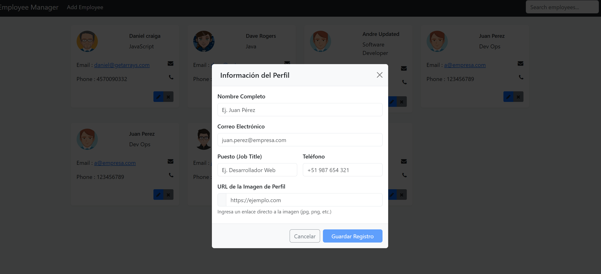
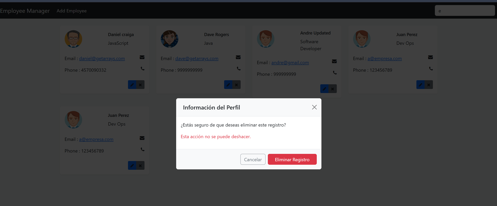

# Employee Manager API & Web Application

[](https://angular.dev/)
[](https://spring.io/projects/spring-boot)
[](https://www.oracle.com/java/)
[](https://www.typescriptlang.org/)
[](https://getbootstrap.com/)

Sistema de gestión de empleados Full Stack desarrollado con **Spring Boot** en el backend y **Angular** en el frontend. El proyecto implementa operaciones CRUD completas, filtrado reactivo en tiempo real y comunicación mediante REST API con gestión de CORS.

> **Atribución y Créditos:** Este proyecto se basa en el tutorial conceptual de [Get Arrays (YouTube)](https://www.youtube.com/watch?v=Gx4iBLKLVHk&t=5252s). Fue refactorizado y actualizado integralmente utilizando las últimas versiones estables de las tecnologías: **Spring Boot 3 (migrado a Jakarta EE)** y **Angular moderno (Standalone Components + Signals API)**.

---

## Capturas de Pantalla

| Vista General | Búsqueda en Tiempo Real |
| :---: | :---: |
|  |  |

| Editar Empleado | Eliminar Empleado |
| :---: | :---: |
|  |  |

---

## Arquitectura de la Aplicación
```bash

Clientele_Manager/
├── employeemanager/             # Backend (Spring Boot 3 + Spring Data JPA)
│   └── src/main/java/tech/getArray/employeemanager/
│       ├── EmployeemanagerApplication.java  # Punto de entrada + Configuración CORS
│       ├── EmployeeResource.java            # Controlador REST (Endpoints)
│       ├── exception/
│       │   └── UserNotFoundException.java   # Manejo de excepciones de negocio
│       ├── model/
│       │   └── Employee.java                # Entidad JPA / Tabla de Base de Datos
│       ├── repo/
│       │   └── EmployeeRepo.java            # Repositorio JPA
│       └── service/
│           └── EmployeeService.java         # Lógica de servicio y transacciones
│
└── employeemanagerapp/          # Frontend (Angular + Signals API)
└── src/app/
├── app.ts               # Componente principal (Gestión de estado con Signals)
├── app.html             # Template con Modales Bootstrap y Directivas
├── employee-service.ts  # Servicio HTTP para consumo de REST API
└── employee.ts           # Interfaz de datos TypeScrip
```

## Configuración e Instalación Local

### Requisitos Previos

* Java JDK 17 o superior.
* Node.js 18.x o superior.
* Angular CLI v17+.
* Base de datos MySQL / PostgreSQL (o H2 en memoria para pruebas).

### 1. Clonar el repositorio

```bash
git clone https://github.com/tu-usuario/Clientele_Manager.git
cd Clientele_Manager
```

### 2. Configuración e Inicio del Backend

1. Navega al directorio del backend:

```bash
cd employeemanager
```

2. Modifica el archivo `src/main/resources/application.properties` con tus credenciales de base de datos:

```properties
spring.datasource.url=jdbc:mysql://localhost:3306/employeemanager
spring.datasource.username=tu_usuario
spring.datasource.password=tu_contraseña
spring.jpa.hibernate.ddl-auto=update
```

3. Ejecuta la aplicación:

```bash
./mvnw spring-boot:run
```

El servidor iniciará en `http://localhost:8080`.

### 3. Configuración e Inicio del Frontend

1. Abre una nueva terminal y navega al proyecto frontend:

```bash
cd employeemanagerapp
```

2. Instala las dependencias:

```bash
npm install
```

3. Verifica la URL del backend en `src/environments/environment.ts`:

```typescript
export const environment = {
  production: false,
  apiUrl: 'http://localhost:8080'
};
```

4. Inicia el servidor de desarrollo:

```bash
ng serve
```

5. Abre tu navegador e ingresa a:

`http://localhost:4200`